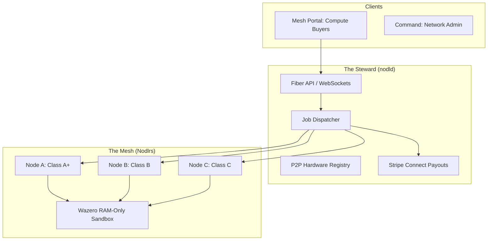

# Wnode: The Decentralized Compute Fabric

A sovereign, simple to use community‑owned compute network (DEPIN) that harvests old, redundant or idle hardware of any level and transforms it into a globally distributed, confidentiality‑preserving compute layer.

---

## 🌐 Vision

Wnode is a Sovereign DePIN that replaces new datacenters with the hardware the world already owns, delivering confidential RAM‑only execution at lower cost while reducing carbon impact and paying participants for the compute they contribute. 3 clicks and earn.

### The Pillars
- **Zero‑Storage** - Data never touches a disk.
- **RAM‑Only Compute** - Everything runs in volatile memory and self‑erases.
- **Economic Neutrality** - A transparent, immutable affiliate revenue model that evolves into an revenue generating asset and rewards the network, not the middleman or large corporations.
- **Fully Managed** – The Mesh remains community‑owned, with a steward corporation holding a permanent license to expertly manage and operate the infrastructure on behalf of its owners.

---

## 📚 Canonical Documentation

Our documentation is the **Sovereign Source of Truth** for the network's architecture, economics, and governance.

- **[Vision & Architecture](docs/vision-and-architecture.md)**: The "Why" and "How" of Wnode.
- **[Governance & Economics](docs/governance-and-economics.md)**: Payout splits and constitutional locks.
- **[Steward Constitution](docs/steward-constitution.md)**: The rules that bind the network authority.
- **[Economic Safeguards](docs/economic-safeguards.md)**: 120-Day holds, Ghost Protocol, and Honeypots.
- **[RAM Execution Model](docs/ram-execution-model.md)**: Technical security guarantees.
- **[Compute Tiers](docs/compute-tiers.md)**: Hardware specs from Tiny to Ultra GPU.

---

## 🏗️ Architecture



---

## 🚀 Quick Start

### Prerequisites
- **Go 1.22+**
- **Node.js 18+** (for frontend portals)
- **Stripe Account** (for Nodlr payouts)

### Run the Backend (Steward)
```bash
cd nodld
cp .env.example .env
go mod tidy
go run ./cmd/nodld
```

### Run the Command Dashboard
```bash
cd apps/command
npm install
npm run dev
```

---

## 🛠️ Project Structure

| Directory | Description |
| :--- | :--- |
| **`/nodld`** | Core Go daemon handling P2P, Jobs, and Payments. |
| **`/docs`** | Canonical documentation library. |
| **`/apps/command`** | Admin control plane for network oversight. |
| **`/apps/mesh`** | Buyer marketplace for compute procurement. |
| **`/apps/nodlr`** | Provider portal for node management and earnings. |
| **`/apps/shared`** | Shared UI components and logic. |

---

## ⚖️ Economics (80/20 Rule)

Wnode is built for fairness. Every job follows a hardcoded commission waterfall:

- **Operator**: 80% (Direct to Nodlr)
- **Steward**: 7% (Platform Maintenance)
- **Affiliate Tree**: 10% (Growth Incentive: 3% L1, 7% L2)
- **Founder**: 3% (Genesis Override)

*Note: All withdrawals are subject to a **120-Day Compliance Hold** to ensure network integrity.*

---

## 🔐 Security & Integrity

- **libp2p Mesh**: Uses WebRTC Direct, WebTransport, and Noise-encrypted channels.
- **Hardware DNA**: Enforces the **1M1N (One Machine One Node)** rule to prevent virtualization farms.
- **Ghost Protocol**: Automatically shadow-benches compromised or malicious nodes.
- **Honeypot Checks**: Periodic timing-based audits to detect VMs via hardware jitter.

---

## 🤝 Contributing

We welcome community participation. Please review our **[Steward Update Policy](docs/steward-update-policy.md)** before submitting pull requests.

## 📄 License

This project is licensed under the **MIT License** - see the [LICENSE](LICENSE) file for details.

---

© 2026 Wnode Ltd (UK). The sovereign compute marketplace.

## Community

Join the Wnode developer community on Discord:

<a href="https://discord.gg/EUXJMZsFCt">
  
</a>
