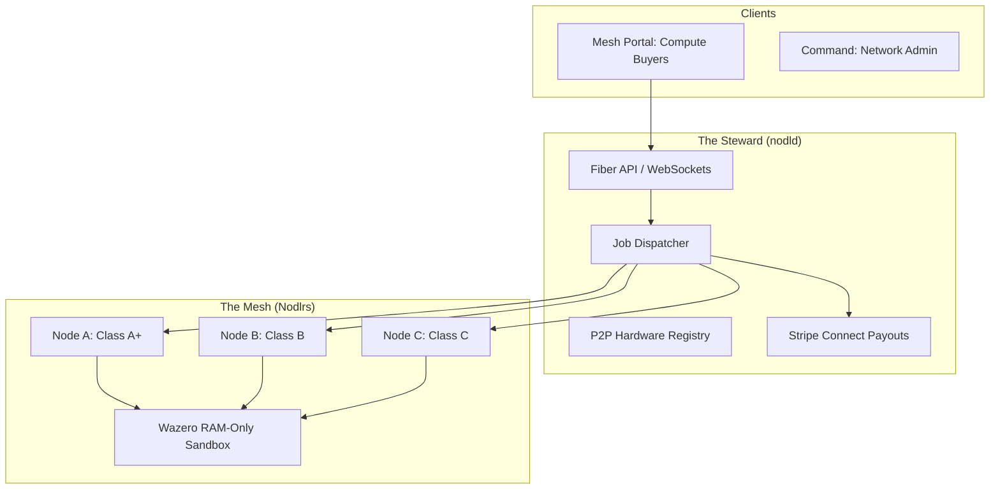

# wnode: The Decentralized Compute Fabric

[](https://github.com/wnode-one/wnode)
[](https://opensource.org/licenses/MIT)
[](docs/steward-metrics.md)

**Harvest the Idle.** Turn unused CPU/GPU cycles on consumer devices into a global, sustainable, and confidentiality-preserving compute mesh.

---

## 🌐 Vision

wnode is a **Sovereign DePIN (Decentralized Physical Infrastructure Network)** designed to democratize high-performance compute. By activating existing idle resources in homes and offices, we eliminate the need for new hyperscale datacenters, reducing carbon footprints while providing enterprise-grade, RAM-only execution for sensitive workloads.

### The Three Pillars
1.  **Zero-Storage**: No user data ever touches a physical disk.
2.  **RAM-Only Execution**: Workloads exist only in volatile memory and are wiped instantly.
3.  **Economic Neutrality**: A hardcoded 80/20 revenue split ensures participants—not the platform—capture the value.

---

## 📚 Canonical Documentation

Our documentation is the **Sovereign Source of Truth** for the network's architecture, economics, and governance.

- **[Vision & Architecture](docs/vision-and-architecture.md)**: The "Why" and "How" of wnode.
- **[Governance & Economics](docs/governance-and-economics.md)**: Payout splits and constitutional locks.
- **[Steward Constitution](docs/steward-constitution.md)**: The rules that bind the network authority.
- **[Economic Safeguards](docs/economic-safeguards.md)**: 120-Day holds, Ghost Protocol, and Honeypots.
- **[RAM Execution Model](docs/ram-execution-model.md)**: Technical security guarantees.
- **[Compute Tiers](docs/compute-tiers.md)**: Hardware specs from Tiny to Ultra GPU.

---

## 🏗️ Architecture



---

## 🚀 Quick Start

### Prerequisites
- **Go 1.22+**
- **Node.js 18+** (for frontend portals)
- **Stripe Account** (for Nodlr payouts)

### Run the Backend (Steward)
```bash
cd nodld
cp .env.example .env
go mod tidy
go run ./cmd/nodld
```

### Run the Command Dashboard
```bash
cd apps/command
npm install
npm run dev
```

---

## 🛠️ Project Structure

| Directory | Description |
| :--- | :--- |
| **`/nodld`** | Core Go daemon handling P2P, Jobs, and Payments. |
| **`/docs`** | Canonical documentation library. |
| **`/apps/command`** | Admin control plane for network oversight. |
| **`/apps/mesh`** | Buyer marketplace for compute procurement. |
| **`/apps/nodlr`** | Provider portal for node management and earnings. |
| **`/apps/shared`** | Shared UI components and logic. |

---

## ⚖️ Economics (80/20 Rule)

wnode is built for fairness. Every job follows a hardcoded commission waterfall:

- **Operator**: 80% (Direct to Nodlr)
- **Steward**: 7% (Platform Maintenance)
- **Affiliate Tree**: 10% (Growth Incentive: 3% L1, 7% L2)
- **Founder**: 3% (Genesis Override)

*Note: All withdrawals are subject to a **120-Day Compliance Hold** to ensure network integrity.*

---

## 🔐 Security & Integrity

- **libp2p Mesh**: Uses WebRTC Direct, WebTransport, and Noise-encrypted channels.
- **Hardware DNA**: Enforces the **1M1N (One Machine One Node)** rule to prevent virtualization farms.
- **Ghost Protocol**: Automatically shadow-benches compromised or malicious nodes.
- **Honeypot Checks**: Periodic timing-based audits to detect VMs via hardware jitter.

---

## 🤝 Contributing

We welcome community participation. Please review our **[Steward Update Policy](docs/steward-update-policy.md)** before submitting pull requests.

## 📄 License

This project is licensed under the **MIT License** - see the [LICENSE](LICENSE) file for details.

---

© 2026 wnode Ltd (UK). The sovereign compute marketplace.

## Community

Join the Wnode developer community on Discord:

<a href="https://discord.gg/EUXJMZsFCt">
  
</a>
