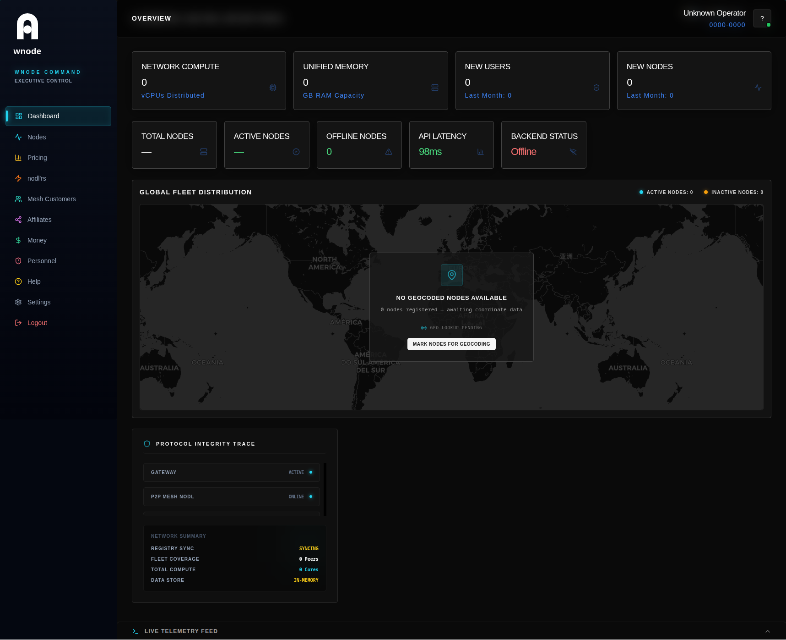
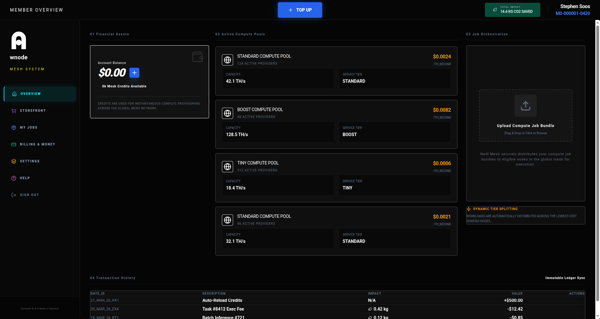

# 🌍 Wnode — The Planetary Compute Mesh
### Turn your idle devices into real daily income.

**Phones, laptops, EVs, smart TVs, and more become part of a shared, community‑owned compute network.**  
**No crypto. No wallets. Daily payouts in real currency via Stripe.**  
**Wnode MVP is live and open for beta testers.**

---

---

## 💡 Why Wnode Exists
The world already has more compute power than all data centres combined — sitting idle in billions of pockets, homes, offices, factories, and cars. 

We don’t need more concrete, more cooling towers, or more power‑hungry server farms.  
**Wnode connects what already exists** and turns unused compute into a shared resource that pays the people who run it.

This is compute infrastructure owned by everyone — not another hyperscaler.

---

## ⚙️ How It Works
1.  **Install the Node Operator app** (lightweight, simple) or run the node via WASM directly in your browser/device. 🖱️
2.  **Your device contributes spare CPU/GPU when idle.** 🔋
3.  **Real workloads** (ML inference, rendering, batch jobs, etc.) are processed. 🧠
4.  **You get paid daily** in real currency via Stripe. 💰

Designed to be accessible to everyone — from non‑technical users with old devices to developers and entrepreneurs building teams.

---

## 👥 Who It’s For
*   **Everyday people** — Turn old devices into passive income. 🏠
*   **Entrepreneurs** — Build teams, onboard others, and earn from the network you grow. 📈
*   **Developers** — Run nodes, contribute code, improve the mesh. 💻
*   **Early believers** — Help shape a community‑owned compute network. ✨

---

## 🚦 Current Status
**MVP Live** — Beta testing and final bug‑fixing underway.  
We’re actively looking for:
*   Beta node operators 🧑‍💻
*   Early task submitters 📤
*   Developers & contributors 🛠️
*   Community builders 🤝

---

## 🏗️ Core Components
*   **Lightweight Node Operator desktop app** (Coming Soon)
*   **WASM node** for browsers and lightweight devices
*   **Decentralised mesh coordination protocol**
*   **Distributed task scheduling & execution**
*   **Compute verification layer**
*   **Transparent revenue distribution** (Stripe payouts)
*   **DAO governance** (1 Soul = 1 Vote)

---

## 📱 Supported Devices
Anything with a CPU or GPU:
*   **Smartphones** 📱
*   **Laptops & desktops** 💻
*   **EVs & smart vehicles** 🚗
*   **Robots** 🤖
*   **Smart TVs** 📺
*   **IoT devices** 🔌
*   **Servers & workstations** 🖥️

---

## 📈 Economics — Simple & Transparent
.png)

*   **Node Operators**: Earn the majority of the compute revenue their devices generate.
*   **Community Builders / Affiliates**: Earn 3% on Level 1 and 7% on Level 2 from the compute revenue of devices you help onboard.
*   **Steward (Management Licencee)**: Receives a fixed, capped operational fee.
*   **DAO**: Holds ultimate governance (upgrades, economics, direction).

**Daily payouts via Stripe in real FIAT, no tokens, no volatility, no friction.**

---

## 🚀 Getting Started (Beta)
Ready to run your first node?
*   → **Node Operator App** (coming soon)
*   → **Run via WASM** — [live now](docs) (see `/docs`)

Full installation guides and troubleshooting are in the `/docs` folder.  
*This is an early MVP — expect occasional bugs. Your feedback directly shapes the project.*

**Join the community:**
*   [Discord](https://discord.gg/EUXJMZsFCt) 💬
*   [Website](https://wnode.one) 🌐

---

## 🛠️ For Developers & Contributors
We welcome contributions across code, architecture, testing, and documentation.
*   [Architecture overview](docs/vision-and-architecture.md)
*   [Building from source](docs/DEVELOPER_GUIDE.md)
*   [Contributing guidelines](docs/CONTRIBUTING.md)
*   [Open issues & discussions](https://github.com/wnode/wnode/issues)

---

## 🗺️ Roadmap
*   **MVP Beta** (current) 📍
*   **Stability improvements** & expanded device support
*   **DAO activation**
*   **Expanded workloads**
*   **Robotics & EV optimisation**
*   **Global scaling**

---

**Wnode belongs to the community.**  
Run a node. Earn real income. Help build the alternative to centralised cloud infrastructure.

---
© 2026 Wnode Ltd. The planetary compute mesh.
