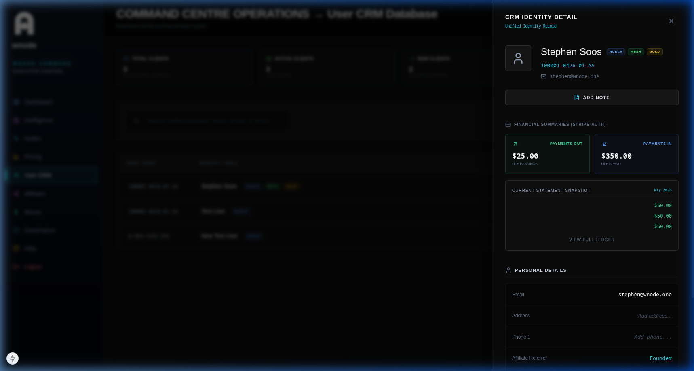

# CRM (Users & WUIDs)

The User CRM is the authoritative registry for all platform participants.

## What is a WUID?
A WUID (Wnode Universal ID) is the canonical identifier for any account in the ecosystem. It is immutable and serves as the primary key for:
- Ledger transactions
- Affiliate mappings
- Node ownership

## CRM Slide-Out Operations
Clicking any user row in the CRM database opens the Detail Slide-out.
- **Identity Verification:** View official email, phone, and address data.
- **Network Status:** Real-time count of active nodes.
- **Financials Tab:** Displays the WUID-anchored ledger.

## Payments In/Out
- **Payments In:** Billing events, compute top-ups, and subscription payments.
- **Payments Out:** Earnings distributions, commissions, and payout transfers.
