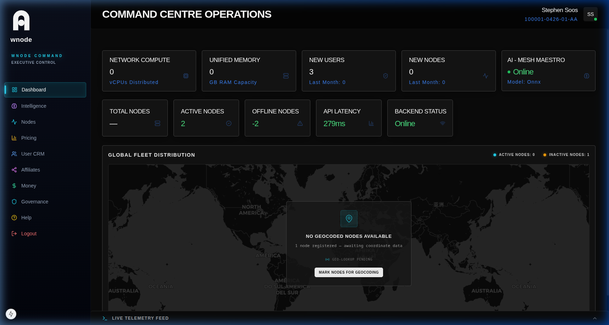

# Dashboard Overview

The Command Centre Operations dashboard provides a high-density, real-time visualization of the global mesh network.

## Functional Zones

### 1. Vitals
High-level aggregates of the network's current state:
- **Total vCPUs:** Aggregate compute cores.
- **Unified Memory:** Total RAM across the fleet.
- **Network Growth:** User and Node increases this month.

### 2. Operational Metrics
Real-time health indicators:
- **API Latency:** Round-trip time for core services.
- **Connectivity:** Status of the authoritative backend.

### 3. Global Fleet Map
A geospatial representation of all active and inactive nodes worldwide.

## How Metrics Work
Metrics are polled every 10 seconds from the authoritative backend. Each card provides specific tooltips explaining the data source.
