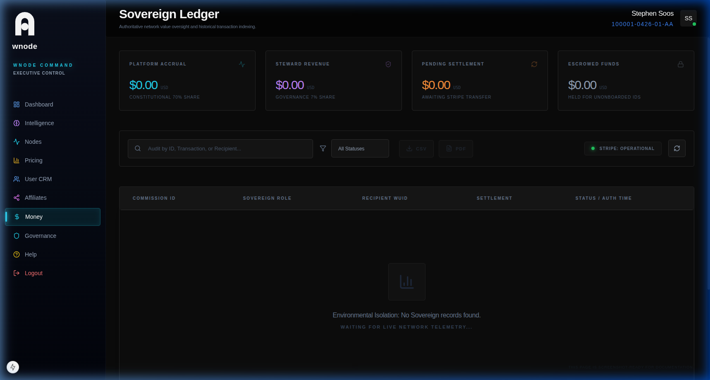

# Ledger (Financials)

The Sovereign Money Engine is the authoritative financial core of the Wnode ecosystem.

## Ledger Components

### 1. Payments In (Mesh Revenue)
- Revenue entering the platform (compute purchases, top-ups).
- Anchored to WUIDs via Stripe metadata.

### 2. Payments Out (Nodlr Earnings)
- Value distribution to participants (node earnings, commissions).
- Protocol-level enforcement of the 80/20 revenue manifest.

### 3. Monthly Statements
- Monthly-grouped views for accounting.
- **PDF Export:** Branded executive summaries for audit compliance.
- **CSV Data:** Raw ledger dumps for reconciliation.
