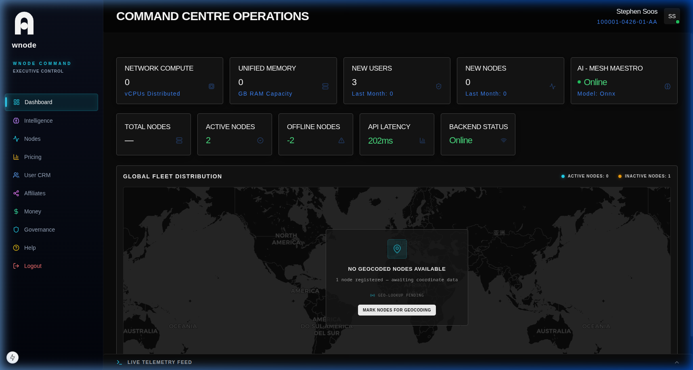

# Navigation & Layout

Understanding the sidebar, panels, and slide-out patterns is key to efficient resource management.

## Interface Patterns

### 1. Global Sidebar
- Primary navigation anchor for Operations, Network, and Finances.

### 2. Modular Content Panels
- Pages are built using "Sovereign" panels dedicated to specific data subsets.

### 3. Contextual Slide-outs
- Detailed records (Users, Nodes, Transactions) open in a right-hand drawer to maintain context.
- Features internal tabs for deep-dive metadata.
