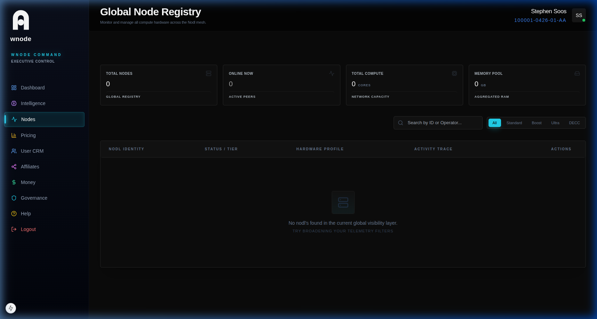

# Nodes (Compute Health)

The Node Inventory provides a real-time census of all hardware active in the mesh.

## Node Status Indicators
- **Active / Online:** Heartbeating and ready to accept tasks.
- **Offline:** Missed consecutive heartbeats.
- **Flagged:** Integrity issues (VM detection, DNA collision).
- **Maintenance:** Administrative lockdown.

## Compute Health Metrics
- **Latency:** Round-trip time (ms) to coord anchor.
- **RAM Usage:** Memory overhead of active tasks.
- **Integrity Score:** SHA-256 hardware DNA verification.
