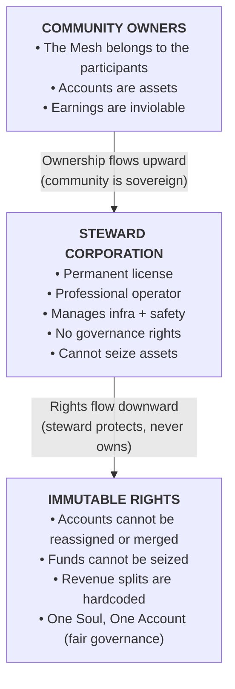

# Economic Safeguards

## Overview
Economic safeguards in Wnode exist to protect the community’s assets and ensure a fair, fraud‑resistant marketplace for compute. They are not punitive, not extractive, and never used to withhold earnings from honest participants.

**The Mesh is community‑owned.**

The steward corporation operates the infrastructure under a permanent license, but cannot claim, redirect, or interfere with participant assets or governance rights.

---

## 1. Account Freezes (Protection, Not Punishment)
If a clear, high‑confidence violation is detected, such as stolen hardware, industrial‑scale virtualization, or coordinated sybil activity, the steward may temporarily freeze an account.

A freeze means:
- No new routing
- No new L1 affiliate additions
- No loss of existing earnings
- No confiscation of funds
- No reassignment of the account

Funds always remain the property of the participant. A freeze is reversible and exists only to prevent ongoing harm. An account can only be permanently removed if there is proven criminal activity, such as a court ruling or equivalent legal determination. Even then, the account is treated as an **immutable asset**; it cannot be merged, reassigned, or claimed by the steward.

---

## 2. Integrity Verification
To protect honest participants from dilution by bad actors, the steward uses minimal, privacy‑preserving checks:
- **Shadow Benchmarks**: Harmless no‑op tasks that help detect virtualized farms or sybil clusters.
- **Timing Signatures**: Occasional checks to ensure hardware matches its declared profile.

These checks never inspect user data, never access workloads, and never interfere with legitimate compute.

---

## 3. One Soul, One Account (Fair Governance)
Wnode’s governance is built on equal representation.
- Each human participant receives one governance identity.
- Creating additional accounts under personal, corporate, or proxy names does not grant additional votes.
- This prevents power consolidation and ensures that no individual or entity can dominate the DAO.

This rule protects the community, not the steward.

---

## 4. Economic Neutrality (Hardcoded Fairness)
The steward is constitutionally restricted from:
- Reassigning accounts
- Merging founder trees
- Altering commission splits
- Redirecting revenue
- Accessing plaintext data
- Influencing pricing for personal gain

**The steward operates the network; the community owns it.**

---

## Summary
Wnode’s economic safeguards are designed to be fair, transparent, and non‑intrusive. They distinguish clearly between:
- **Honest mistakes** → corrected without penalty
- **Uncertain cases** → temporarily paused, never confiscated
- **Proven criminal fraud** → account removal only through due‑process

Participants always retain ownership of their earnings, their account, and their long‑term revenue rights. The result is a network where people can earn confidently, knowing their assets are protected and the steward’s role is professional, limited, and constitutionally bound.

